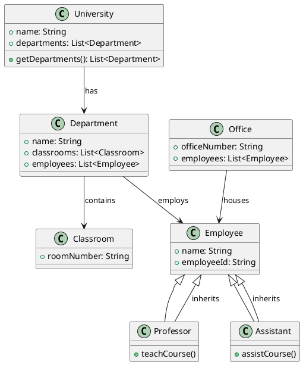

# University Class Diagram

```plantuml
@startuml

class University {
    +name: String
    +departments: List<Department>
    +getDepartments(): List<Department>
}

class Department {
    +name: String
    +classrooms: List<Classroom>
    +employees: List<Employee>
}

class Office {
    +officeNumber: String
    +employees: List<Employee>
}

class Classroom {
    +roomNumber: String
}

class Employee {
    +name: String
    +employeeId: String
}

class Professor extends Employee {
    +teachCourse()
}

class Assistant extends Employee {
    +assistCourse()
}

University --> Department : "has"
Department --> Classroom : "contains"
Department --> Employee : "employs"
Office --> Employee : "houses"
Professor --|> Employee : "inherits"
Assistant --|> Employee : "inherits"
@enduml
```